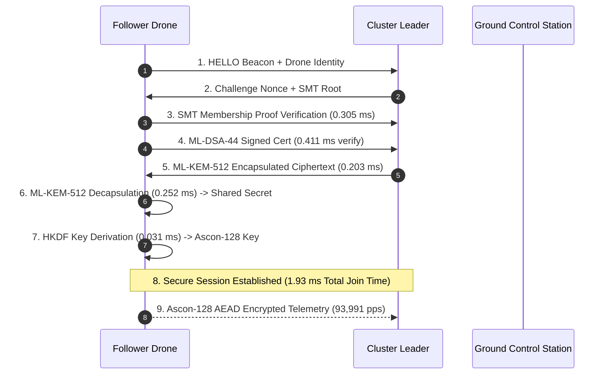
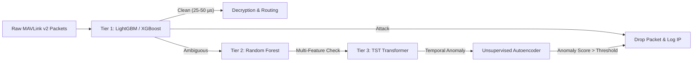

# Post-Quantum Cryptographic Drone Tunnel & Hierarchical UAV Swarm Architecture

[](https://www.raspberrypi.com/)
[](https://csrc.nist.gov/projects/post-quantum-cryptography)
[-cyan.svg)](https://ascon.iaik.tugraz.at/)
[-orange.svg)](https://datatracker.ietf.org/doc/html/rfc9162)
[-red.svg)](https://github.com/AnugrahaSaji/UAV-Swarm1)
[-yellow.svg)](https://www.ti.com/product/INA219)

> **IIIT Internship Research Project**: An end-to-end post-quantum cryptographic security tunnel, lightweight AEAD streaming engine, multi-tier real-time DDoS defense cascade, and energy-aware dynamic task scheduler designed specifically for resource-constrained UAV companion computers (Raspberry Pi 4 / Pixhawk 2.4.8).

---

## 📌 Executive Summary

Modern Unmanned Aerial Vehicles (UAVs) relying on MAVLink v2 telemetry channels face dual security threats:
1. **Quantum Cryptanalysis**: Traditional public-key algorithms (RSA, ECDH, ECDSA) are vulnerable to Shor's algorithm on upcoming quantum computers.
2. **Volumetric DDoS & Packet Injection**: Aerial wireless networks are exposed to real-time packet flooding and command injection attacks.

This project delivers a **production-grade, code-verified, high-performance security architecture** engineered for single-board companion computers running under strict energy (~3.25W) and compute (<1% CPU overhead) constraints.

---

## 🚀 Key Achievements & Benchmarks

| Metric / Parameter | Performance Result | Architectural Significance |
| :--- | :---: | :--- |
| **Average Node Join Latency** | **1.93 ms** (Min: 1.16 ms, P95: 3.27 ms) | Instantaneous cryptographic swarm authorization |
| **ML-KEM-512 Key Gen / Encap** | **0.174 ms** / **0.203 ms** | Sub-millisecond NIST FIPS 203 post-quantum KEX |
| **ML-DSA-44 Signature Gen / Verify** | **1.660 ms** / **0.411 ms** | NIST FIPS 204 post-quantum identity authentication |
| **Ascon-128 AEAD Encryption** | **0.0050 ms** (5.0 $\mu$s) | **$3.56\times$ faster than AES-128-GCM** |
| **Sustained Ascon AEAD Speed** | **93,991.15 packets/sec** | Zero telemetry bottlenecking on MAVLink v2 streams |
| **$O(1)$ Route Lookup Latency** | **0.0015 ms** (1.5 $\mu$s) | Microsecond forwarding decision caching |
| **Cluster Leader Failover Time** | **0.00 ms** (Recovery) / **0.45 ms** (Redistribution) | Seamless mission continuity during leader dropouts |
| **System Resource Footprint** | **< 1.0% CPU** / **43.18 MB RAM** | Zero background thread pool contention |
| **INA219 Hardware Power Draw** | **3251.20 mW** (5.08V @ 640mA) | Minimal battery endurance penalty (<12 sec / 20 min flight) |

---

## 🏗️ System Architecture

### 1. 3-Tier Hierarchical UAV Swarm Topology
```
                     ┌─────────────────────────────┐
                     │   Ground Control Station    │
                     │           (GCS)             │
                     └──────────────┬──────────────┘
                                    │ ML-KEM / SMT Certificate
                                    ▼
                     ┌─────────────────────────────┐
                     │     Tier 1: Root Leader     │
                     │  (Global SMT & CERT Trust)  │
                     └──────────────┬──────────────┘
                                    │
           ┌────────────────────────┴────────────────────────┐
           ▼                                                 ▼
┌────────────────────┐                            ┌────────────────────┐
│ Tier 2: Cluster A  │                            │ Tier 2: Cluster B  │
│   (Leader Node)    │                            │   (Leader Node)    │
└──────────┬─────────┘                            └──────────┬─────────┘
           │                                                 │
     ┌─────┴─────┐                                     ┌─────┴─────┐
     ▼           ▼                                     ▼           ▼
┌─────────┐ ┌─────────┐                           ┌─────────┐ ┌─────────┐
│ Follower│ │ Follower│                           │ Follower│ │ Follower│
│ Drone 1 │ │ Drone 2 │                           │ Drone 3 │ │ Drone 4 │
└─────────┘ └─────────┘                           └─────────┘ └─────────┘
```

* **Tier 1 (Root Leader)**: Manages global swarm state, 256-level SMT root certificates, and GCS uplink.
* **Tier 2 (Cluster Leaders)**: Monitors follower liveness, tracks regional heartbeats, and handles sub-2ms local failover.
* **Tier 3 (Follower Drones)**: Executes flight missions, verifies SMT proofs, and streams Ascon-encrypted telemetry.

---

### 2. Post-Quantum Cryptographic Handshake Pipeline


---

### 3. Multi-Tier Real-Time DDoS Defense Cascade


---

## 📜 Standards & Cryptographic References

| Security Component | Standard / Citation Authority | Purpose |
| :--- | :--- | :--- |
| **ML-KEM-512** | **NIST FIPS 203** (Module-Lattice Key Encapsulation) | Post-quantum session key exchange |
| **ML-DSA-44** | **NIST FIPS 204** (Module-Lattice Digital Signatures) | Post-quantum identity authentication & signing |
| **Ascon-128 AEAD** | **NIST LWC Standard** (Lightweight Cryptography) | Microsecond telemetry packet streaming |
| **Sparse Merkle Tree** | **IETF RFC 9162 & IACR ePrint 2016/683** | $O(1)$ zero-knowledge membership/non-membership proof |
| **Hash Primitives** | **NIST FIPS 180-4 / FIPS 202** (BLAKE2b / SHA-256) | Collision-resistant domain-separated node hashes |

---

## 📂 Repository Directory Layout

```
.
├── core/                       # Core PQC Cryptographic Stack & Handshake Logic
│   ├── aead.py                 # Ascon-128 & AES-128-GCM AEAD Adapters
│   ├── handshake.py            # ML-KEM / ML-DSA Handshake Manager
│   └── suites.py               # Cipher Suite Registry & Feature Probing
├── smt/                        # 256-Level Stateless Sparse Merkle Tree (SMT)
│   ├── hash_engine.py          # Domain-separated BLAKE2b/SHA256 hash routines
│   ├── node.py                 # Leaf & Internal Node Data Structures
│   ├── operations.py           # Bitwise traversal & insertion algorithms
│   ├── tree.py                 # High-level SMT storage & proof management
│   └── verifier.py             # SMT Membership & Non-membership Verifier
├── ddos/                       # Real-Time DDoS Detection Engine
│   ├── lgbm.py                 # Tier 1 LightGBM Classifier (54 features)
│   ├── xgb.py                  # Tier 1 XGBoost Classifier
│   ├── tst.py                  # Tier 3 Temporal Synthesis Transformer
│   ├── features.py             # MAVLink v2 (0xfd) Feature Extraction Engine
│   └── models/                 # Pre-trained ONNX/PyTorch model weights
├── hierarchical_swarm/         # 3-Tier Swarm Topology & Coordination
│   ├── leader.py               # Root & Cluster Leader Managers
│   ├── follower.py             # Follower Drone Node Handler
│   ├── task_manager.py         # Dynamic Task Assigner & Failover Manager
│   └── routing.py              # O(1) Microsecond Route Lookup Engine
├── sitl/                       # Software-In-The-Loop (SITL) Validation & Trust Subsystem
│   ├── sitl_flight_engine.py   # Native ArduPilot/PX4 SITL & MAVLink Telemetry Generator
│   ├── sitl_security_bridge.py # PQC Handshake (ML-KEM-768/ML-DSA-65) + SMT + Ascon AEAD Bridge
│   ├── sitl_attack_simulator.py# Telemetry Tampering, Sybil, and Volumetric DDoS Attack Simulator
│   ├── trust_engine.py         # Multi-Dimensional Dynamic UAV Trust Scoring Engine
│   ├── sitl_e2e_benchmark.py   # Scalable SITL Benchmark Suite (5 to 50 UAV Sweep)
│   └── run_sitl_validation.py  # Master Execution Runner & Report Generator
├── sscheduler/                 # Energy-Aware CPU & Task Scheduler
│   ├── governor.py             # Linux cpufreq / DVFS policy controller
│   └── detector_manager.py     # Adaptive DDoS Classifier Duty-Cycler
├── dashboard/                  # Telemetry Monitoring Web Application
│   ├── backend/                # FastAPI / Express Telemetry Routes
│   └── src/                    # Interactive Dashboard Frontend
├── presentation/               # Slide Decks & Detailed Technical Reports
│   ├── PQC_MAV_Presentation_Master.pptx # Master 15-Slide Presentation Deck
│   └── PQC_MAV_Detailed_Report.pdf      # Detailed Research Report
├── bench/                      # Benchmarking Scripts & Performance Profilers
├── scripts/                    # PowerShell & Bash Deployment Utility Scripts
└── tests/                      # Unit & E2E Integration Test Suite
```

---

## 🛠️ Quick Start & Installation

### 1. Prerequisites
* **Operating System**: Linux (Raspberry Pi OS arm64 recommended) or Windows 10/11.
* **Python Runtime**: Python 3.11 or 3.12 (64-bit).
* **Dependencies**: `pip install -r requirements.txt` (including `scapy`, `numpy`, `scikit-learn`, `lightgbm`, `xgboost`, `python-pptx`, `ascon`).

### 2. Clone & Environment Setup
```bash
git clone https://github.com/AnugrahaSaji/UAV-Swarm1.git
cd "Project new code"
python -m venv .venv
source .venv/bin/activate  # On Windows: .venv\Scripts\activate
pip install -r requirements.txt
```

### 3. Run Cryptographic & SMT Benchmarks
```bash
# Run complete empirical benchmark suite
python bench/bench_aead_detector_matrix.py

# Run DDoS impact & power analysis
python bench/bench_ddos_overhead.py
```

### 4. Launch 3-Drone Swarm Simulator & GCS Bridge
```bash
# Start 3-drone simulated swarm (1 Leader + 2 Followers)
python tools/swarm_3drone_simulator.py

# Start Ground Control Station (GCS) telemetry bridge
python tools/gcs_mavlink_forwarder.py
```

### 5. Execute Native SITL Validation & Multi-Dimensional Trust Benchmark
```bash
# 1. Test 5-drone native SITL connection and security bridge
python sitl/run_sitl_validation.py --mode sitl --drones 5

# 2. Execute native SITL scalable sweep from 5 to 50 drones
python sitl/run_sitl_validation.py --mode sitl --sweep --max-drones 50
```

---

## 📄 Presentations & Artifacts

* 📊 **Master PowerPoint Presentation**: [`presentation/PQC_MAV_Presentation_Master.pptx`](file:///c:/Users/TOSHIBA/Documents/iiit%20internship/IIIt%20UAV/Project%20new%20code/presentation/PQC_MAV_Presentation_Master.pptx)
* 📝 **Slide Deck Markdown Guide**: [`presentation_overview.md`](file:///C:/Users/TOSHIBA/.gemini/antigravity-ide/brain/14471588-558a-40cc-bfd6-e754991928f4/presentation_overview.md)
* 📋 **Performance Evaluation Summary**: [`summary.md`](summary.md)
* 🔬 **SOTA DDoS Comparison Report**: [`SOTA_DDOS_COMPARISON.md`](SOTA_DDOS_COMPARISON.md)

---

## 🏷️ License & Academic Citation

Developed as part of the **IIIT UAV Swarm Security Internship Project**.

```bibtex
@article{saji2026pqc_uav_swarm,
  title={Post-Quantum Cryptographic Tunnel and Multi-Tier DDoS Defense for Hierarchical UAV Swarms on Resource-Constrained Edge Hardware},
  author={IIIT UAV Security Research Group},
  journal={IIIT Research Technical Report},
  year={2026}
}
```
