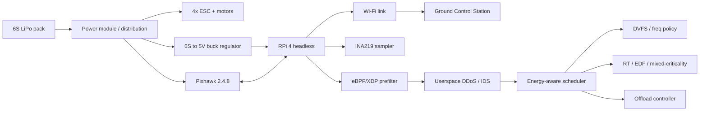
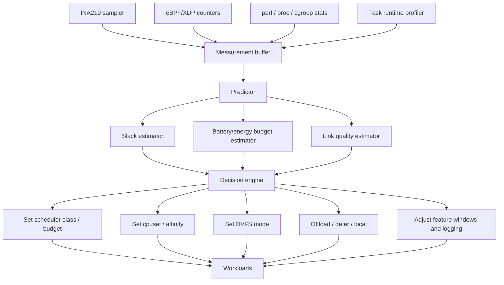
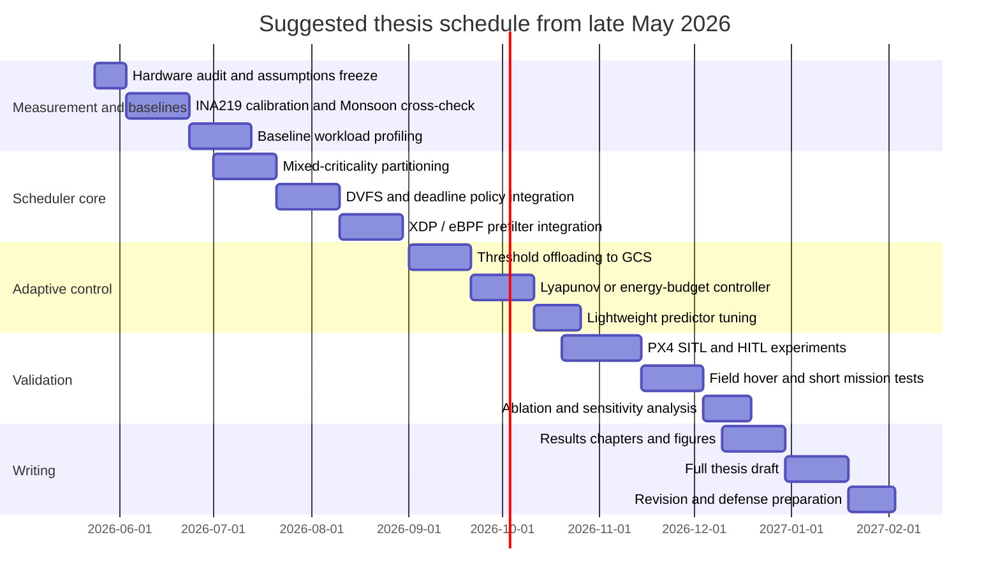

# Energy-Aware Scheduling for a Raspberry Pi 4 Companion Computer on a Shared 6S LiPo F450 Quadrotor

## Executive summary

This report is tailored to your stated platform: an F450 quadrotor using a shared 6S LiPo battery, a Pixhawk 2.4.8 flight controller, and a headless Raspberry Pi 4 companion that runs Wi‑Fi networking, a DDoS-security workload, and a user-specified post-quantum key-exchange component. The most important system-level fact is that the Pi 4 is a **symmetric** quad-core Cortex‑A72 platform, while Linux’s upstream Energy Aware Scheduling framework is currently aimed at **asymmetric** CPU topologies and explicitly reports no meaningful savings on SMP platforms. In practice, that means your strongest lever is **not** generic kernel EAS; it is a combination of **cpufreq/DVFS policy, mixed-criticality CPU partitioning, deadline-aware scheduling for short periodic tasks, kernel-space packet prefiltering, offload thresholds to the GCS, and adaptive reduction of noncritical work**. citeturn58view0turn11view2turn11view4turn51view0

For your specific thesis problem, the best upgrade path is:

1. **Protect flight-adjacent threads first**: reserve one core budget for MAVLink/telemetry bridge, watchdogs, and the power sampler; use `cpuset` isolation plus either `SCHED_FIFO` for very short event threads or `SCHED_DEADLINE` for periodic threads with explicit budgets and periods. Linux documents `SCHED_DEADLINE` as EDF plus CBS isolation, with admission control and optional bandwidth reclaiming. citeturn11view0turn51view0turn52view0turn52view2  
2. **Reduce userspace networking cost**: if your DDoS pipeline has a cheap first-stage filter, move it into **eBPF/XDP** and keep only suspicious flows in userspace. A recent Pi‑4 evaluation reported over 97% mitigation effectiveness under a 100 Mbps flood while preserving legitimate traffic. citeturn42academia0  
3. **Treat PQ key exchange as a bursty, deferrable task unless a hard deadline says otherwise**: benchmark it locally with `liboqs`/OpenSSL-provider or `PQClean`, then schedule it under a slack-aware DVFS/offload policy. NIST finalized ML‑KEM in FIPS 203 in 2024, and recent embedded measurements show that PQC costs are measurable enough to matter for an energy-aware scheduler. citeturn23view0turn31view0turn32view1turn32view2turn42academia1turn42academia2  
4. **Do not trust the nominal 1 kHz INA219 polling rate as a true fresh-sample rate** unless you have configured the ADC carefully. TI’s datasheet gives **532 µs** for a **single 12-bit conversion**; in continuous **shunt+bus** mode the effective fresh-data period is approximately one shunt conversion plus one bus conversion, so a fully fresh combined sample is about **1.064 ms** before I²C overhead. This is one of the most actionable details for your measurement methodology. citeturn14view2turn14view3  
5. **Model the drone as propulsion-dominated and the Pi as rail-constrained**: the quadrotor’s total endurance will mostly be set by propulsion, but a strong Pi scheduler still matters because it reduces brownout risk on the 5 V rail, creates headroom for security bursts, lowers thermal throttling probability, and tightens timing under attack. For the aircraft-side energy model, start with the canonical rotary-wing propulsion model and then calibrate coefficients on your exact frame, motors, props, and takeoff mass. citeturn34academia0turn34academia1turn58view0

The recommended thesis implementation order is therefore: **instrumentation and profiling**, then **mixed-criticality isolation + DVFS**, then **kernel-space DDoS prefiltering**, then **threshold/Lyapunov-style offloading**, and only then **ML-based prediction**. That order gives publishable intermediate results even if the full scheduler is not finished. citeturn44view0turn42academia0turn48academia2

## System frame, assumptions, and source priority

The discovery order prioritized for this review was: **Google, Google Scholar, arXiv, IEEE Xplore, ACM Digital Library, SpringerLink, Elsevier/ScienceDirect, and ResearchGate**, followed by primary and official sources including **PX4, ArduPilot, Raspberry Pi, Linux kernel, NIST, TI INA219, Monsoon, ROS 2, and the original code repositories**. The final evidence base below leans most heavily on original papers, vendor datasheets, kernel documentation, standards, and official repositories.

I also attempted to ground assumptions in any prior uploaded files and connected sources. In this session, **no retrievable File Library or connected-source content was available**, so prior files did **not** influence the technical assumptions. The assumptions therefore come from your typed context and the public primary sources only.

Your explicitly stated hardware context implies several constraints. The Raspberry Pi 4 provides a quad-core Cortex‑A72 SoC, dual-band 802.11ac Wi‑Fi, and requires a **5 V input with a minimum 3 A supply**. The INA219 supports **0–26 V bus sensing**, programmable conversion times, and calibration-based direct current/power readout. Because a standard 6S LiPo is assumed to approach the INA219 voltage ceiling when fully charged, rail placement and transient margin matter; measuring the **Pi branch** rather than the raw propulsion bus is usually the safer choice for thesis-grade repeatability unless you are deliberately characterizing the high-side 6S input to the Pi regulator. citeturn58view0turn13view0turn14view2turn14view3turn57view0

The main unspecified details that materially affect scheduler design are shown below.

| Unspecified item | Why it matters | Assumption used in this report |
|---|---|---|
| Exact Raspberry Pi OS version, kernel version, and whether PREEMPT_RT is enabled | Determines availability and behavior of `SCHED_DEADLINE`, `schedutil`, cgroup RT interactions, and tracing fidelity | Assumed modern mainline-style Linux with `SCHED_DEADLINE`, cpufreq, cgroup v2, and LTTng-capable tracing available; PREEMPT_RT not assumed |
| Exact Pi 4 RAM variant | Affects memory pressure and cache behavior under DDoS/PQC bursts | Assumed RAM is sufficient to avoid swap during experiments |
| Exact 6S-to-5V regulator topology and efficiency | Converts Pi-side watts into pack-side watts; important for total-energy estimates | Assumed a dedicated buck converter powers the Pi from the shared battery |
| Exact EMAX motor model, prop size/pitch, ESC model, all-up mass, and hover throttle | Necessary for propulsion coefficients and total endurance estimates | Treated as unknown; propulsion model is left symbolic, then calibrated empirically on your airframe |
| Exact autopilot stack on Pixhawk 2.4.8 | Companion-link details differ between PX4 and ArduPilot | Assumed MAVLink-based companion operation; both PX4 and ArduPilot companion docs are provided as starting points citeturn8view0turn8view2 |
| Exact INA219 shunt value, wiring point, ADC config, and calibration math | Determines current range, LSB, update rate, and measurement error | Assumed you will set calibration explicitly from shunt value and expected current using TI’s formulas citeturn57view0turn57view3 |
| Wi‑Fi link quality, contention, and GCS compute specs | Offloading only makes sense if the link is energy- and deadline-favorable | Assumed GCS is ground-powered and Wi‑Fi quality is variable rather than guaranteed |
| “Liobnoqs” implementation details | Operation cost, memory, and concurrency determine whether to defer/offload or accelerate | No public source was found during the public-source sweep; I therefore use **ML‑KEM / liboqs / PQClean** as proxy baselines, clearly marked as proxies citeturn23view0turn31view0turn32view0 |
| `pios CLI` details | Could affect telemetry/process topology | No public official source was retrieved; treated as a GCS-side commander/telemetry client |

A crucial platform conclusion follows directly from the Raspberry Pi and Linux scheduler documentation: **do not center your thesis around Linux EAS on Pi 4**. The kernel documentation states that EAS is currently supported on asymmetric topologies and that no significant savings have been observed on SMP platforms, while Pi 4 is a symmetric quad-core Cortex‑A72 machine. Your scheduler should therefore operate **above** default Linux fairness: through cpufreq policy, scheduling classes, cgroups/cpuset partitioning, executor design, and application-level adaptation. citeturn58view0turn11view2turn11view3turn11view4

## Prioritized annotated bibliography

### Academic papers and standards

The table below is prioritized for **implementation relevance** rather than citation count. “Direct link” is provided through the citation attached to each item.

| Priority | Paper or standard | Why it matters for your thesis | Direct link |
|---|---|---|---|
| Start here | **Qiao, Fang, Cidon, “Energy-Aware Process Scheduling in Linux,” HotCarbon 2024.** The paper introduces **Wattmeter**, an eBPF-based millisecond-scale per-process energy accounting method, then demonstrates energy-fair and energy-capped policies on Linux without invasive kernel rewrites. It is the closest public paper to your scheduler problem formulation. citeturn44view0 | It gives you a concrete architecture for **measure → attribute → schedule**, and it explicitly argues that CPU time fairness and energy fairness diverge. | PDF. citeturn44view0 |
| Start here | **Linux kernel documentation for `SCHED_DEADLINE`.** Linux documents `SCHED_DEADLINE` as **EDF + CBS**, with admission control, reclaiming, and ARM energy-aware behavior when used with `schedutil`. citeturn51view0 | This is your most defensible production-grade mechanism for periodic Pi threads with explicit runtime budgets. | Official docs. citeturn51view0 |
| Start here | **Yao, Demers, Shenker, “A Scheduling Model for Reduced CPU Energy,” FOCS 1995.** The seminal DVS result models power as a **convex function of speed** and proves minimum-energy schedules under arrival/deadline constraints. citeturn50view1 | It is still the theoretical backbone for slack reclamation, DVFS, and EDF-with-energy arguments in edge systems. | PDF. citeturn50view1 |
| Start here | **Zeng, Xu, Zhang, “Energy Minimization for Wireless Communication with Rotary-Wing UAV,” 2018.** This work is the modern canonical analytical rotary-wing propulsion model used across UAV energy papers. citeturn34academia0 | It gives a principled propulsion baseline and shows why total energy is not just a function of Euclidean distance. | arXiv. citeturn34academia0 |
| Start here | **Dai et al., “Energy-Efficient UAV Communications: A Generalised Propulsion Energy Consumption Model,” 2022.** This extends propulsion modeling to practical thrust-to-weight effects under velocity, acceleration, and turns. citeturn34academia1 | It is closer to a real F450 mission than constant-speed hover/cruise abstractions. | arXiv. citeturn34academia1 |
| Start here | **Patterson, Buchanan, Turino, “Energy Consumption Framework and Analysis of Post-Quantum Key-Generation on Embedded Devices,” 2025.** A Raspberry-Pi–focused measurement framework for PQC energy. citeturn42academia1 | Use it as the closest published prior for your PQ workload characterization section. | arXiv. citeturn42academia1 |
| Start here | **NIST FIPS 203, ML-KEM, 2024.** NIST finalized ML‑KEM and states the three parameter sets in order of increasing security and decreasing performance. citeturn23view0 | This is the standards anchor if you benchmark your custom “Liobnoqs” work against a public PQ KEX baseline. | Official standard. citeturn23view0 |
| Next | **Tolay, “eBPF-Based Real-Time DDoS Mitigation for IoT Edge Devices,” 2025.** Evaluated on Raspberry Pi 4 with XDP/eBPF and reports over 97% mitigation effectiveness at 100 Mbps flood. citeturn42academia0 | This is the strongest directly relevant recent security paper for the “move cheap filtering to kernel space” part of your scheduler. | arXiv. citeturn42academia0 |
| Next | **Sobhani, Choi, Kim, “Timing Analysis and Priority-driven Enhancements of ROS 2 Multi-threaded Executors,” 2024.** Finds that default ROS 2 multi-threaded execution is not ideal for critical chains and proposes priority-driven improvements. citeturn55academia0 | Only essential if your Pi stack uses ROS 2 or MAVROS-style callback chains; otherwise optional. | arXiv. citeturn55academia0 |
| Next | **Bédard, Lütkebohle, Dagenais, “ros2_tracing,” RA-L 2022.** The official repository points to the paper and the tracing framework for Linux/ROS 2. citeturn24view0 | Useful for black-box timing/latency validation if your scheduler spans ROS 2 nodes. | Repo and paper link. citeturn24view0 |
| Next | **He et al., “An Online Joint Optimization Approach for QoE Maximization in UAV-Enabled Mobile Edge Computing,” 2024.** Uses Lyapunov optimization to convert a future-dependent joint offloading/resource/trajectory problem into per-slot real-time control. citeturn48academia2 | The exact application differs, but the control structure is highly reusable for your **energy queue / offload threshold** design. | arXiv. citeturn48academia2 |
| Next | **Michel, Patnaik, Kong, Lin, “Energy-Optimal Planning of Waypoint-Based UAV Missions,” 2024.** Shows that minimum-distance waypoint order is often not minimum-energy order; average differences are nontrivial and worst-case differences can be large. citeturn35academia0 | This strengthens the argument that “runtime minimization” and “energy minimization” are not interchangeable in drone systems. | arXiv. citeturn35academia0 |
| Supporting | **Amirtharaj, Groot, Dezfouli, “Profiling and Improving the Duty-Cycling Performance of Linux-based IoT Devices,” 2018.** Improves device lifetime by reducing Linux bring-up and active time, with 13.9%–30.2% lifetime gains across tasks. citeturn17academia1 | Not drone-specific, but excellent support for adaptive suppression of avoidable noncritical work. | arXiv. citeturn17academia1 |
| Supporting | **Xia, Fattah, Babar, “A Survey on UAV-enabled Edge Computing: Resource Management Perspective,” 2022.** A useful map of offloading/resource-allocation literature. citeturn49academia3 | Helps position your thesis in the UAV-edge scheduler literature without over-reading dozens of offloading papers. | arXiv. citeturn49academia3 |

### Official projects, repositories, and toolchains

| Priority | Project | Why it matters | Direct link |
|---|---|---|---|
| Start here | **PX4 companion computer documentation** | Official grounding for companion-computer integration and simulation workflow. | Docs. citeturn8view0turn26view0 |
| Start here | **ArduPilot companion computer documentation** | Important if your Pixhawk 2.4.8 setup is ArduPilot-based rather than PX4-based. | Docs. citeturn8view2 |
| Start here | **TI INA219 datasheet** | Primary source for bus limit, calibration register math, LSBs, and conversion timing. | Product page and datasheet. citeturn13view0turn13view1turn14view3turn57view0 |
| Start here | **Raspberry Pi 4 official specs** | Primary source for CPU, Wi‑Fi, and power-input requirements. | Official specs. citeturn58view0 |
| Start here | **Open Quantum Safe `liboqs`** | Open-source C library with common API and benchmark routines for quantum-safe algorithms. citeturn31view0 | It is the most practical public benchmark harness for your PQ proxy experiments. | Repo. citeturn31view0 |
| Start here | **`oqs-provider` for OpenSSL 3** | Enables PQ/hybrid KEM in a standard OpenSSL stack, but explicitly warns that it is for research/prototyping, not production-sensitive deployment. citeturn32view1turn32view2 | Excellent for controlled bench tests; not a production claim. | Repo. citeturn32view1turn32view2 |
| Start here | **PQClean** | Clean, portable, tested PQ implementations; ideal for reproducible isolated algorithm benchmarks. citeturn32view0turn32view3 | Very useful if you want to strip away TLS/OpenSSL overhead and measure only cryptographic cost. | Repo. citeturn32view0turn32view3 |
| Start here | **`sched_ext/scx`** | Linux BPF-extensible scheduler sandbox for rapid experimentation; actively released in 2026. citeturn54view0turn54view3 | This is the most forward-looking environment for thesis-grade custom scheduler research on Linux. | Repo. citeturn54view0turn54view3 |
| Supporting | **Google `ghOSt` userspace** | Great conceptual reference, includes EDF and other schedulers, and explicitly mentions energy efficiency objectives; however the repository is archived. citeturn53view0 | Read for ideas; prefer `sched_ext` for new implementation work. | Repo. citeturn53view0 |
| Supporting | **`ros2_tracing`** | Low-overhead tracing for ROS 2 on Linux with LTTng support. citeturn24view0 | Only relevant if your stack uses ROS 2. | Repo. citeturn24view0 |
| Supporting | **ROS 2 `performance_test`** | ROS 2 messaging benchmark tool; the GitHub repo is deprecated and points to GitLab. citeturn24view1turn25view1 | Use if ROS 2 middleware/executor overhead is part of the thesis. | ROS index and deprecated repo. citeturn24view1turn25view1 |
| Supporting | **Monsoon HVPM and PyMonsoon** | Best external cross-check for bench power traces; official docs and Python library are available. citeturn15view0turn15view1turn15view2 | Strongly recommended for validating INA219 results. | Docs and repo. citeturn15view0turn15view1turn15view2 |
| Supporting | **Adafruit CircuitPython INA219 driver** | Practical Linux-friendly driver path for Pi prototypes. citeturn15view4 | Good for rapid instrumentation, though research-grade timing may still warrant a leaner C/Python binding. | Repo. citeturn15view4 |
| Optional | **AirSim** | Open-source simulator with PX4/ArduPilot SITL support. citeturn25view4 | Useful for networked and higher-level simulation stacks. | Docs. citeturn25view4 |
| Optional | **Flightmare** | Flexible quadrotor simulator. citeturn25view5 | Better for agile quadrotor research than for network-stack realism. | Repo. citeturn25view5 |
| Optional | **OpenVINS** and **ORB‑SLAM3** | Not current-priority because you have no camera attached, but useful for future “extra background load” experiments. citeturn25view2turn25view3 | Treat as optional future workloads, not thesis-critical now. | Repos. citeturn25view2turn25view3 |

## Scheduling strategies tailored to Pi 4, Pixhawk, shared 6S power, and INA219

The best scheduler for your setup is not a single algorithm. It should be a **hierarchical policy stack**: kernel scheduling primitives for isolation, a lightweight energy controller for frequency and admission decisions, and task-specific control for DDoS filtering, PQ bursts, and telemetry adaptation. That conclusion is consistent with Linux scheduling documentation, the Wattmeter paper, and recent UAV offloading literature. citeturn44view0turn51view0turn48academia2turn49academia3

### Mixed-criticality partitioning

Your first design move should be to partition the Pi workload into at least four classes:

- **Class A**: flight-adjacent and safety-support tasks, such as MAVLink/serial bridging, heartbeat handling, watchdogs, and the power-sampler thread.  
- **Class B**: fast-path security tasks, such as cheap packet parsing, counters, or XDP-based drop decisions.  
- **Class C**: compute-heavy but deadline-bearing tasks, such as PQ key exchange, packet-feature extraction, or periodic security scoring.  
- **Class D**: best-effort tasks, such as logging, trace export, compression, updates, and retrospective analytics.

Use `cpuset` to constrain Class A and optionally Class B to a reserved CPU set. Linux cgroup v2 documents cpuset as the mechanism that constrains CPU placement, and the man page / kernel docs describe the appropriate RT and deadline classes for the other tasks. Keep in mind that cgroup v2’s CPU controller does **not** cleanly provide bandwidth control for RT processes under some kernel configurations, so RT threads often need to stay in the root cgroup or be handled carefully. citeturn11view0turn11view1turn52view0turn52view2

For implementation, a practical layout on the Pi 4 is:

- reserve one core primarily for Class A;
- allow Class B on either the same core in kernel/XDP form or on a second core if userspace work is necessary;
- run Class C on the remaining cores under explicit budgets;
- demote Class D aggressively when battery, thermals, or network attack load worsen.

That is more defensible on Pi 4 than relying on Linux EAS because the platform is SMP, not heterogeneous Arm big.LITTLE. citeturn58view0turn11view4

### Deadline-aware scheduling for periodic work

For periodic Pi tasks, `SCHED_DEADLINE` is the most technically rigorous baseline because Linux defines it as **EDF with CBS isolation**, explicit `(runtime, deadline, period)` parameters, and admission control that rejects infeasible configurations. It also supports bandwidth reclaiming and, when `schedutil` is used, energy-aware behavior on ARM architectures. citeturn51view0turn52view2

For your system, good candidates for `SCHED_DEADLINE` are:

- the **INA219 sampler** if you redesign it around realistic fresh-sample periods rather than nominal 1 kHz polls;
- a **periodic feature extractor** for security statistics;
- **PQ KEX batches** if they occur at predictable intervals;
- any control loop that must react within a bounded period.

A workable design rule is:

\[
U_{\text{dl}}=\sum_i \frac{C_i}{T_i} \le U_{\text{budget}}
\]

where \(C_i\) is measured worst-case execution time under attack load, \(T_i\) is the task period, and \(U_{\text{budget}}\) is kept below one core’s capacity for the isolated core or below the reserved capacity of the target CPU set. CBS then enforces non-interference among deadline tasks by throttling budget overruns. citeturn51view0turn52view2

For short signal/bridge handlers that are event-driven rather than periodic, `SCHED_FIFO` is still appropriate, but keep the critical sections extremely short because FIFO tasks run until block, preempted by higher priority, or yield. citeturn52view0

### DVFS and frequency control

Because the Pi 4 is not an EAS target, **DVFS becomes your main energy knob**. The classic result from Yao–Demers–Shenker is that CPU energy is minimized by exploiting slack on a variable-speed processor whose power grows convexly with speed; Linux’s scheduler documentation makes the practical counterpart explicit through `schedutil` and energy-aware deadline behavior on ARM. citeturn50view1turn51view0

For your thesis, the most useful DVFS policy is not “always min frequency.” It is a **slack-aware cap**:

\[
f_t = \min \left(f_{\max}, \max\left(f_{\min}, \frac{\hat C_t}{S_t}\right)\right)
\]

where \(\hat C_t\) is predicted remaining compute for the next control window and \(S_t\) is the available slack before the next Class‑A or Class‑C deadlines. In words: if the scheduler predicts low backlog and generous slack, reduce frequency; if the queue or attack intensity rises, restore frequency quickly.

For DDoS and PQ workloads, pair DVFS with **mode selection**:

- **Eco mode**: reduced frequency, longer feature windows, deferred KEX, lower trace verbosity.  
- **Nominal mode**: standard frequency, normal feature windows.  
- **Defense mode**: full frequency, XDP enabled, userspace classifier priority raised, logging decimated to protect deadlines.

This mode-based design is more stable than continuously nudging frequency every few milliseconds. It also respects the fact that Pi frequency changes, task migrations, and cache effects can erase theoretical DVFS gains if the control loop is too twitchy. That caution follows directly from the Linux energy and real-time scheduling documentation. citeturn51view0turn50view1

### Kernel-first DDoS scheduling

If your DDoS algorithm has any cheap first-pass features, put them **before** userspace. The recent eBPF/XDP-on-Pi‑4 study is directly relevant: it validates that rate-based attack identification and mitigation can live in the kernel/driver path and hold up under flood conditions with high mitigation effectiveness. citeturn42academia0

The practical pattern is:

1. **XDP/eBPF prefilter** for packet-rate, source-frequency, or sketch-based coarse decisions.  
2. **Userspace Class C classifier** only for suspect flows.  
3. **Policy controller** decides whether to tighten filters, widen feature windows, or offload summarization to the GCS.

This changes your scheduler problem significantly. Instead of scheduling every packet-feature extraction task equally, you schedule only the “hard cases,” which cuts both CPU energy and wakeup overhead under attack. The same reasoning is consistent with Linux’s own drive toward low-overhead tracing and BPF-based control. citeturn42academia0turn44view0

### Threshold and Lyapunov offloading to the GCS

Because your GCS is not battery-limited by the drone pack, offloading can be very attractive for **bursty, high-compute, not-flight-critical** workloads such as batch PQ handshakes, model refresh, or retrospective packet-feature aggregation. But offloading only helps if transmission energy and delay are lower than local execution cost. That decision should be explicit:

\[
D_{\text{local}} = \frac{C}{f}
\]

\[
E_{\text{local}} \approx P_{\text{pi}}(f,u)\,D_{\text{local}}
\]

\[
D_{\text{off}} = \frac{S_u}{R_u} + D_{\text{remote}} + \frac{S_d}{R_d}
\]

\[
E_{\text{off}} \approx P_{\text{tx}}\frac{S_u}{R_u} + P_{\text{rx}}\frac{S_d}{R_d} + P_{\text{idle}} D_{\text{remote}}
\]

Offload only if both \(D_{\text{off}} \le D_{\text{deadline}}\) and \(E_{\text{off}} < E_{\text{local}}\). This matches the framing of UAV-edge offloading literature, including recent online Lyapunov-style formulations that convert future-dependent joint optimization into per-slot decisions. citeturn48academia2turn49academia3turn45academia1

A simple Lyapunov-style control variable for your system is an **energy-deficit queue** \(Z_t\):

\[
Z_{t+1} = \max\left(0,\, Z_t + E_t - B_t\right)
\]

where \(E_t\) is measured Pi-side energy in slot \(t\) and \(B_t\) is the permitted slot budget derived from current battery state and mission phase. At each slot, choose the action \(a_t\) that approximately minimizes:

\[
\alpha \cdot \text{latency}(a_t) + \beta \cdot \text{energy}(a_t) + \gamma \cdot Z_t
\]

with \(a_t \in\{\text{local-fast}, \text{local-economy}, \text{offload}, \text{defer}\}\). This is not a verbatim result from the cited paper; it is a **direct adaptation** of the same Lyapunov-control idea to your Pi/GCS setting. citeturn48academia2

### Adaptive sampling without a camera

Since you have no camera, “adaptive sampling” should mean **adaptive sensing and feature extraction rates** for power, network, and security telemetry. The most useful knobs are:

- **INA219 logging decimation** after acquisition, not overpolling the sensor itself;
- **packet-feature window size** and recomputation interval;
- **telemetry/report cadence** to the GCS;
- **cryptographic retry/backoff timing** and batching;
- **trace verbosity** and event filtering.

The literature on Linux IoT duty-cycling and edge security supports the general principle: lifetime and performance improve when the platform avoids unnecessary active work, and attack mitigation benefits from moving only the minimum necessary logic to expensive userspace paths. citeturn17academia1turn42academia0

### Recommended strategy stack

| Strategy | Complexity per control step | Conservative expected Pi-side energy effect | Latency effect | Intrusiveness | Best use in your platform |
|---|---:|---:|---|---|---|
| Mixed-criticality core partitioning with `cpuset` | Low | Indirect but important | Strongly improves tail latency | Low | First step; protects Pixhawk-adjacent and sampler tasks citeturn11view0turn52view0 |
| `SCHED_DEADLINE` for periodic threads | Low to medium | Low to moderate | Strong positive when budgets are accurate | Medium | Sampler, periodic security features, batched crypto citeturn51view0turn52view2 |
| Slack-aware DVFS / cpufreq modes | Low | Moderate on CPU-bound Class C tasks | Mild increase if slack estimate is wrong | Low to medium | PQ bursts, feature extraction, low-attack phases citeturn50view1turn51view0 |
| XDP/eBPF prefilter before userspace DDoS logic | O(1) per packet fast path | High under flood conditions | Strong positive | Medium to high | Best improvement under attack citeturn42academia0 |
| Threshold offloading to GCS | Low | Moderate to high for bursty compute if Wi‑Fi is good | Can improve or degrade; depends on link | Medium | Batch crypto, retrospective analytics citeturn48academia2turn45academia1 |
| Lyapunov-style energy-budget controller | Medium | Moderate, especially over long missions | Average-latency trade-off is tunable | Medium | Battery-aware switching among local/offload/defer modes citeturn48academia2 |
| Adaptive telemetry / feature-rate reduction | Low | Moderate | Small effect if applied only to noncritical work | Low | Logging, GCS reports, full-flow feature extraction citeturn17academia1 |
| ML predictor for runtime/energy | Medium at inference, high offline training | Moderate if predictions remain stable | Best when queues are bursty | Medium to high | Thesis Phase 2 rather than Phase 1 citeturn44view0turn49academia3 |

The “expected energy effect” column is intentionally conservative and should be treated as an engineering estimate, not a literature guarantee. Your thesis should validate those ranges experimentally on your hardware.

## Energy models and per-task estimation

A credible thesis will need at least **three coupled energy models**: propulsion, Pi-side compute/network, and battery/SOC. The contribution should not be “I found the perfect analytical model.” It should be “I identified a model simple enough to use online and accurate enough to drive scheduling decisions.” That is a stronger and more defensible thesis position. citeturn34academia0turn34academia1turn44view0

### Propulsion model for the F450-class quadrotor

For a rotary-wing UAV flying at horizontal speed \(V\), the widely used analytical propulsion model from Zeng et al. is:

\[
P_{\text{prop}}(V)=P_0\left(1+\frac{3V^2}{U_{\text{tip}}^2}\right)
+P_i\left(\sqrt{1+\frac{V^4}{4v_0^4}}-\frac{V^2}{2v_0^2}\right)^{1/2}
+\frac{1}{2}d_0\rho s A V^3
\]

where \(P_0\) is profile power in hover, \(P_i\) is induced power in hover, \(U_{\text{tip}}\) is blade-tip speed, \(v_0\) is mean rotor induced velocity in hover, \(d_0\) is fuselage drag ratio, \(\rho\) is air density, \(s\) is rotor solidity, and \(A\) is rotor disc area. At hover, \(V=0\), so the model reduces to \(P_{\text{hover}}=P_0+P_i\). citeturn34academia0

For your actual F450/EMAX/6S system, the generalized model from Dai et al. is more realistic because it accounts for thrust-to-weight behavior under velocity, acceleration, and direction changes. That matters in real missions where security or communications tasks may coincide with turns, climbs, or loiter transitions rather than idealized constant-speed cruise. citeturn34academia1

In practice, because your exact motor, propeller, ESC, and mass are unspecified, I recommend **empirical identification** of the coefficients rather than attempting a purely first-principles rotor derivation. The minimum useful fit is:

\[
P_{\text{prop}} \approx a_0 + a_1 T + a_2 T^{3/2} + a_3 V^3 + a_4 |a|
\]

where \(T\) is normalized thrust demand and \(a\) is translational acceleration magnitude. Fit \(a_i\) from hover, climb, forward-flight, and descent logs. The Zeng/Dai papers then serve as the theoretical justification for the chosen terms. citeturn34academia0turn34academia1

### Pi-side power model

For the Pi branch, the most practical online model is additive and empirically fitted:

\[
P_{\text{pi}}(t) = P_{\text{idle}}
+ P_{\text{cpu}}(u_{\text{cpu}}, f, T_{\text{cpu}})
+ P_{\text{net}}(r_{\text{tx}}, r_{\text{rx}}, \lambda_{\text{pkt}})
+ P_{\text{mem}}(b_{\text{mem}})
+ P_{\text{io}}(b_{\text{io}})
+ P_{\text{sensor}}
\]

A good first approximation for the CPU term is a convex speed relation informed by DVS theory:

\[
P_{\text{cpu}} \approx k_1 u_{\text{cpu}} f^{\beta} + k_2 u_{\text{cpu}}
\]

with \(\beta > 1\) fitted from measurement. The Wattmeter paper provides empirical motivation for why equal CPU time does not imply equal energy across processes, and the YDS model explains why the frequency term should be treated as convex rather than linear. citeturn44view0turn50view1

Because Pi 4 officially supports 802.11ac Wi‑Fi and your system is headless with no camera, the network and CPU terms are likely much more important than GPU/CSI terms. That is why the scheduler should track at least CPU utilization, packet rate, throughput, and thermals. citeturn58view0

### INA219 measurement model and calibration formulas

TI’s INA219 documentation gives exactly the formulas you need for a research-grade measurement stack. The chip supports **0–26 V bus sensing**, direct readout of current and power after calibration, and programmable ADC timing. The relevant equations are: citeturn13view0turn57view0turn57view3

\[
\text{Current\_LSB} \approx \frac{I_{\max}}{32767}
\]

or choose the next convenient round value above that minimum for easier interpretation.

\[
\text{CAL} = \operatorname{trunc}\left(\frac{0.04096}{\text{Current\_LSB}\cdot R_{\text{shunt}}}\right)
\]

\[
\text{Power\_LSB} = 20 \cdot \text{Current\_LSB}
\]

\[
V_{\text{bus}} = (\text{BusReg} \gg 3)\cdot 4\text{ mV}
\]

\[
V_{\text{shunt}} = \text{ShuntReg}\cdot 10\mu\text{V}
\]

\[
I = \text{CurrentReg}\cdot \text{Current\_LSB}
\]

\[
P = \text{PowerReg}\cdot \text{Power\_LSB}
\]

The most important timing fact is that **12-bit conversion time is 532 µs per conversion**. In continuous shunt+bus mode, the device converts shunt and bus sequentially, while current/power arithmetic is done in the background. Therefore a fresh combined shunt+bus observation at 12-bit with no averaging is roughly:

\[
\Delta t_{\text{fresh}} \approx t_{\text{shunt}} + t_{\text{bus}}
= 532\mu s + 532\mu s = 1.064\text{ ms}
\]

So “1 kHz INA219 sampling” is really closer to **“about 939 fresh combined samples per second in the ideal no-overhead case.”** Polling at 1 kHz is still useful, but you must not treat all successive register reads as independent sensor updates. citeturn14view2turn14view3

This is exactly the kind of detail thesis examiners notice, because it affects aliasing, attribution, and any learning-based predictor trained on the power stream.

### Battery and SOC model

For online scheduling, a simple and defensible LiPo pack model is **coulomb counting plus OCV-Rint correction**:

\[
SOC_{k+1}=SOC_k-\frac{\eta\,I_k\,\Delta t}{Q_n}
\]

\[
V_t = OCV(SOC,T) - I\,R_0 - \sum_{i=1}^{N}V_{c,i}
\]

with optional RC states \(V_{c,i}\) if you want relaxation dynamics:

\[
\frac{dV_{c,i}}{dt} = -\frac{1}{R_iC_i}V_{c,i} + \frac{1}{C_i}I(t)
\]

Recent battery-estimation literature emphasizes that coulomb counting alone drifts and that OCV–SOC uncertainty, temperature, and internal-resistance estimation matter significantly for accurate online state estimation. citeturn37academia1turn37academia2turn37academia3

For your thesis, the most practical scheduler-facing quantity is not raw SOC but a **remaining mission energy budget**:

\[
E_{\text{rem}}(t) \approx \int_t^{t_{\text{cutoff}}} V_t(\tau)\,I(\tau)\,d\tau
\]

In implementation, approximate it with short-horizon forecasts from recent current and voltage history. Then derive a compute budget \(B_t\) for the Pi:

\[
B_t = \lambda \, E_{\text{rem}}(t)
\]

where \(\lambda\) is the fraction of remaining battery energy you are willing to allocate to the companion-compute branch over the remaining mission. Because propulsion dominates total energy in most multirotors, \(\lambda\) is usually small, but it still matters operationally on the 5 V rail. citeturn34academia0turn34academia1turn58view0

### Per-task energy estimation

There are two useful levels of per-task energy accounting.

The first is **direct measured incremental energy** on the Pi branch:

\[
E_{\text{task}} = \sum_{k=t_s}^{t_e}\left(P_k - P_{\text{baseline},k}\right)\Delta t
\]

where \(P_{\text{baseline},k}\) is the best available estimate of “everything else that would have happened anyway.” For isolated microbenchmarks, \(P_{\text{baseline}}\) can be the idle or nominal non-task baseline. For multitasking experiments, that becomes less reliable. citeturn44view0turn13view1

The second is **attributed shared energy**:

\[
E_i = \sum_{w \in W}
\left(
\Delta E_{\text{cpu},w}\, \omega^{\text{cpu}}_{i,w}
+
\Delta E_{\text{net},w}\, \omega^{\text{net}}_{i,w}
+
\Delta E_{\text{io},w}\, \omega^{\text{io}}_{i,w}
\right)
\]

with weights such as:

\[
\omega^{\text{cpu}}_{i,w}=\frac{\text{cycles}_{i,w}}{\sum_j \text{cycles}_{j,w}}
\quad
\omega^{\text{net}}_{i,w}=\frac{\text{bytes}_{i,w}}{\sum_j \text{bytes}_{j,w}}
\]

This is the right approach once you begin running the DDoS pipeline, telemetry, and crypto concurrently. It aligns well with the process-energy-accounting logic in Qiao et al., although your implementation will use INA219 and Pi counters rather than RAPL. citeturn44view0

## Evaluation plan, implementation patterns, and starter repos

Your evaluation should proceed in three stages: **bench**, **simulation**, and **field**. That progression matches best practice in robotics systems work because it separates scheduler mechanics from flight noise and then verifies external validity. Official PX4 simulation docs, AirSim, and Flightmare give a credible simulation path; Monsoon and INA219 provide a bench measurement path. citeturn27view1turn27view2turn25view4turn25view5turn15view0turn15view1

### Bench evaluation

Bench experiments should isolate the Pi branch and answer four questions:

1. How much energy does each workload class consume in isolation?  
2. How much latency/jitter does the scheduler introduce?  
3. How stable is the INA219 estimate relative to an external power monitor?  
4. At what point do offloading and XDP actually help?

The bench measurement procedure should be:

- place the INA219 on the Pi power path you are studying and calibrate it from the actual shunt value and expected current range using TI’s formulas;  
- use a monotonic timestamp source and log **both raw sensor values and scheduler events**;  
- cross-check a subset of runs with Monsoon HVPM/PyMonsoon;  
- warm the Pi to a repeatable thermal state before each condition;  
- run each condition at least 20–30 times and report confidence intervals, not only means. citeturn57view0turn57view3turn15view0turn15view1turn42academia1

Suggested bench workloads are:

- **DDoS replay** using CICDDoS2019 CSV/PCAP-derived traces and CAIDA DDoS traces;  
- **general intrusion workload** using UNSW‑NB15 train/test splits;  
- **PQC microbenchmarks** using `liboqs`, `oqs-provider`, or `PQClean`;  
- **scheduler stress** under synthetic CPU and packet bursts;  
- **combined stress** where DDoS traffic and PQ KEX occur together. citeturn40view0turn40view1turn39view0turn39view1turn31view0turn32view0

### Simulation and controller-in-the-loop evaluation

Use PX4 Gazebo SITL as the main reproducible simulation backbone. PX4’s official docs state that Gazebo is the supported simulator for Ubuntu 22.04+, supports multiple vehicle types, supports standalone/network-separated operation, and runs in lockstep with PX4. It also supports changing simulation speed with `PX4_SIM_SPEED_FACTOR`, which is extremely useful for parameter sweeps. citeturn27view1turn27view2

Use AirSim when you need richer environmental/network scenarios or ArduPilot/PX4 SITL variety, and Flightmare when you need agile multirotor research flexibility. AirSim explicitly supports PX4 and ArduPilot SITL and PX4 HIL. citeturn25view4turn25view5

A strong thesis simulation matrix is:

- **SITL scheduler-only**: no real flight hardware, replay mission and network traces.  
- **HITL communication path**: Pixhawk real, Pi real, vehicle simulated.  
- **Field dry-run**: motors off, telemetry and security live.  
- **Field hover/loiter**: short, highly repeatable trajectories only after bench and HITL pass.

### Field evaluation

Because your real aircraft is propulsion-dominated and system coupling is strong, the field test should focus on **repeatable mission segments**, not long uncontrolled flights. Suggested segments are:

- arming and idle-on-ground;
- takeoff and 30–60 s hover;
- loiter;
- short climb/descent segment;
- landing.

For each segment, collect:

- battery voltage/current from the flight stack if available;
- Pi INA219 current/voltage/power;
- task traces and scheduler decisions;
- Wi‑Fi RSSI or a link-quality proxy;
- missed deadlines / packet-drop statistics / DDoS mitigation rate;
- CPU temperature and throttling flags.

The main field outcome is not just “saved X joules.” It is a joint result such as “same security performance with fewer deadline misses and lower Pi-branch energy during hover and attack replay.” That is much easier to defend than claiming a large total-flight-time increase from Pi-side scheduling alone. citeturn34academia0turn42academia0turn44view0

### Key metrics

The core evaluation metrics should be:

| Metric family | Concrete metric | Why it matters |
|---|---|---|
| Energy | Pi-branch energy per task, average power, energy-delay product, Joules per detected attack flow, Joules per PQ handshake | Directly measures scheduler effectiveness |
| Real-time | mean / 95th / 99th latency, jitter, deadline-miss ratio, CBS throttling events, queue backlog | Validates schedulability under mixed criticality |
| Security | mitigation effectiveness, false positive rate, packets dropped, throughput under attack | Ensures energy savings are not bought with useless security |
| Networking | offload success ratio, RTT, retransmissions, throughput, packet rate | Determines when GCS offloading is viable |
| System health | core utilization, context switches, CPU temperature, throttling, memory pressure | Identifies why a policy worked or failed |
| Flight | segment energy, hover power, mission completion, control-link stability | Connects compute policies back to UAV operations |

These metrics are consistent with the measurement priorities in the Linux energy, DDoS-edge, ROS tracing, and UAV edge-control literature. citeturn44view0turn42academia0turn24view0turn48academia2

### Implementation guidance and code architecture

A thesis-friendly software architecture is shown below.

The cleanest code split is:

- **sampler**: isolated thread that reads INA219 and stamps monotonic time;
- **collector**: gathers per-task CPU/network counters;
- **predictor**: EWMA or lightweight regression first, ML later;
- **policy engine**: one mode table plus one threshold/Lyapunov controller;
- **actuator layer**: wrapper around scheduling class, affinity, frequency policy, and offload RPC;
- **experiment harness**: reproducible YAML/JSON profiles for mission phase, traffic trace, and scheduler mode.

Start with simple predictors. An **EWMA runtime predictor** and a **two-threshold battery policy** are sufficient for a first publishable scheduler:

\[
\hat C_{k+1} = \alpha C_k + (1-\alpha)\hat C_k
\]

\[
\text{mode}=
\begin{cases}
\text{Defense} & \text{if } \lambda_{\text{pkt}}>\theta_{\text{attack}} \\
\text{Eco} & \text{if } SOC<\theta_{\text{soc}} \text{ and no hard deadline soon} \\
\text{Nominal} & \text{otherwise}
\end{cases}
\]

Only after that should you add an ML regressor or classifier for better runtime prediction. citeturn44view0turn42academia0turn48academia2

### Recommended repos to start coding now

If you want the shortest path from reading to implementation, start in this order:

| Start order | Repository or docs | Why now |
|---|---|---|
| First | `sched_ext/scx` and Linux scheduling docs citeturn54view0turn51view0turn52view2 | Best current sandbox for scheduler ideas on Linux |
| First | TI INA219 datasheet and your Linux driver path citeturn13view1turn15view4 | Measurement quality determines the whole thesis |
| First | `liboqs`, `oqs-provider`, `PQClean` citeturn31view0turn32view1turn32view2turn32view0 | Gives you public PQ proxy workloads immediately |
| First | XDP/eBPF DDoS baseline paper and implementation path citeturn42academia0 | Biggest likely CPU savings under attack |
| Second | PX4 Gazebo SITL docs citeturn27view1turn27view2 | Reproducible sweeps before field tests |
| Second | Monsoon HVPM/PyMonsoon citeturn15view0turn15view1 | Cross-validates INA219 |
| Optional | ROS 2 `ros2_tracing` and `performance_test` citeturn24view0turn24view1turn25view1 | Only if your stack uses ROS 2 |
| Optional | OpenVINS and ORB‑SLAM3 citeturn25view2turn25view3 | Future “extra load” experiments, not current priority |

## Thesis timeline

A realistic thesis schedule on your platform is shown below. It assumes that mechanical hardware already exists and that the thesis emphasis is systems/software rather than airframe construction.

A strong milestone structure is:

- **Milestone A**: trustworthy power traces and task profiles;
- **Milestone B**: scheduler v1 with core isolation and DVFS;
- **Milestone C**: attack-aware scheduler with kernel prefilter;
- **Milestone D**: offloading controller;
- **Milestone E**: complete bench + SITL + field evaluation;
- **Milestone F**: thesis written around ablations, not only final headline numbers.

If time becomes tight, the best contingency is to **stop after Milestone C** and write a strong thesis around measurement fidelity, deadline protection, and attack-aware energy savings. That still yields a coherent, rigorous contribution.

## Open questions and limitations

Several details remain unresolved because they were not specified or no public source was available in this session. The most important are the **exact EMAX motor/prop/ESC combination**, the **exact 5 V regulator topology and efficiency**, the **Pi OS / kernel / RT configuration**, the **autopilot stack actually running on the Pixhawk**, the **exact wiring and shunt value of the INA219**, and the actual implementation details of **“Liobnoqs”** and **`pios CLI`**. Those unknowns affect coefficient fitting, offload thresholds, and scheduler-class choices.

Two practical cautions are especially important. First, the **INA219 26 V bus limit** leaves very little headroom on a standard fully charged 6S pack, so sensor placement must be deliberate. Second, because the Pi 4 is an SMP Cortex‑A72 machine and Linux EAS is not the right abstraction for that topology, a thesis centered on “turning on EAS” would likely underperform; a thesis centered on **measurement-driven mixed-criticality scheduling** is much more likely to produce a strong result. citeturn13view0turn11view4turn58view0

The highest-confidence implementation recommendation from the full evidence base is therefore:

**build the thesis around a measurement-driven scheduler that combines cpuset isolation, `SCHED_DEADLINE` or tiny RT threads for critical work, slack-aware DVFS modes, XDP/eBPF prefiltering for DDoS traffic, and threshold/Lyapunov offloading for bursty PQ work.** That design is both technically rigorous and realistically implementable on your platform. citeturn44view0turn51view0turn42academia0turn48academia2turn31view0