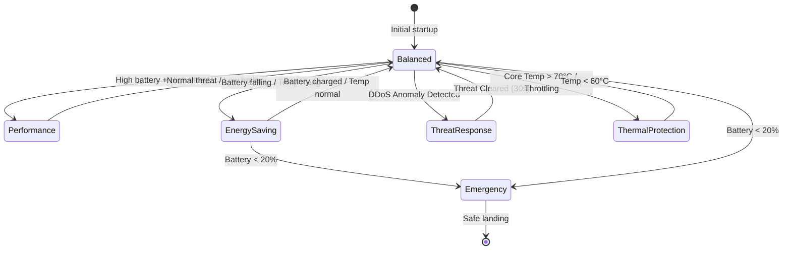

# Measurement-Driven Energy-Aware Scheduling (MDEAS) UAV Architecture Report

This report presents the complete systems design, hardware test bed, state transitions, algorithms, and experimental validation framework for the **Measurement-Driven Energy-Aware Scheduling (MDEAS)** secure UAV communication stack.

---

## 1. System Architecture & Physical Test Bed

The physical test bed is designed for an end-to-end secure UAV communication channel, protecting MAVLink packet telemetry using **Post-Quantum Cryptography (PQC)** and **eBPF-driven runtime security**. It isolates the GCS processing plane from the drone compute plane.

```
       [ WINDOWS GCS ]                                [ UAV COMPANION (Pi 4) ]
┌──────────────────────────┐                        ┌──────────────────────────┐
│ GCS App (MAVProxy/QGC)   │                        │ MAVProxy plain link      │
│            │ (Plaintext) │                        │            ▲ (Plaintext) │
│            ▼             │      Tailscale IP      │            │             │
│   GCS Secure Proxy       │◄──────────────────────►│     Drone Secure Proxy   │
│ (ML-KEM / ML-DSA / AEAD) │   (UDP Port 52080)     │ (ML-KEM / ML-DSA / AEAD) │
└────────────┬─────────────┘                        └────────────┬─────────────┘
             │                                                   │
             ▼ (1 kHz UDP stream)                                ▼ (MAVLink telemetry)
┌──────────────────────────┐                         ┌─────────────────────────┐
│ Windows CT-3 API Bridge  │                         │ Pixhawk1 Flight-Controller│
│            ▲             │                         │ (ArduCopter V4.5.7)     │
│            │ (libusb)    │                         └─────────────────────────┘
│  AVHzY CT-3 Power Meter  │
└──────────────────────────┘
```

### Hardware Component Specifications:
1.  **Ground Control Station (GCS)**: Windows Laptop, running a local Python 3.11 environment in Miniconda (`oqs-dev`), hosting the **AVHzY CT-3 .NET API protocol bridge** over USB.
2.  **UAV Companion Computer**: Raspberry Pi 4 Model B (Broadcom BCM2711 SoC with a quad-core ARM Cortex-A72 64-bit CPU, running Raspberry Pi OS with Linux Kernel 6.12+).
3.  **Flight Controller (FC)**: Pixhawk1 running ArduCopter V4.5.7 connected to the Raspberry Pi over a serial telemetry link (`/dev/ttyACM0`).
4.  **Telemetry Network**: Encrypted UDP data-plane tunnel established over a secure **Tailscale VPN** LAN bridge.
5.  **Power Telemetry Interface**: The physical USB **AVHzY CT-3** power meter sits inline between the Pi's power supply and the Pi itself. Power is read by the Windows host at **~1000 Hz** via the `.NET` bridge and streamed to the Pi over UDP to avoid polling CPU overhead on the drone.

---

## 2. Scheduler Functionality & Operating Modes

The MDEAS scheduler operates as a user-space resource controller. It monitors platform sensors (battery voltage, CPU temperature, throttling state), link performance (pps, gap, jitter), and security severity scores (XGBoost/TST alerts), dynamically transitioning across **six operating modes**:

```mermaid
state_chart
```

````carousel

<!-- slide -->
### MDEAS Scheduler Operating Modes Matrix

| Mode | Trigger Conditions | Core Allocation / CPU Frequency | Cryptographic Configuration (Axis 1 & 2) | eBPF DDoS Detector (Axis 3) & Mitigation |
| :--- | :--- | :--- | :--- | :--- |
| **Performance** | High battery (e.g. >80%), high security threat phase, low thermal state. | All 4 cores active (Affinity budget max), 1.8 GHz frequency policy. | Level 5 PQC Suites (ML-KEM-1024 / ML-DSA-87 / Chacha20-Poly1305). | Hybrid XGBoost Screener + active TST Confirmer. |
| **Balanced** | Normal flight parameters (battery 40% - 80%, CPU temperature < 70°C). | Moderate CPU budget (2-3 workers active), 1.5 GHz scaling. | Level 3 PQC Suites (ML-KEM-768 / ML-DSA-65 / AES-GCM-192). | XGBoost Active; TST sleeps until triggered. |
| **Energy-Saving**| Low battery (<40%) or CPU temperature rising past 70°C. | Reduced worker budget (1-2 cores active), 1.2 GHz scaling. | Level 1 PQC Suites (ML-KEM-512 / ML-DSA-44 / AES-GCM-128). | XGBoost active only. |
| **Emergency** | Battery critical (<20%). | Minimal CPU budget (1 active core), 600 MHz core scaling. | Locks to Level 1 / AES-128-GCM to minimize compute Joules. Rekeying disabled. | DDoS detection disabled. MAVLink only. |
| **Threat-Response**| Volumetric DDoS or attack anomaly confirmed by TST. | Increase CPU budget (allocate all 4 cores to handle filtering loop). | Locked to Level 1 / cheapest AEAD to reduce packet decryption pressure. | Dynamic eBPF/XDP drop rules loaded; IP blocked at kernel boundary. |
| **Thermal-Protection**| Core CPU temp exceeds warn threshold (70°C) or throttling flag set. | Reduce CPU frequency to minimum stable (600 MHz - 900 MHz) using DVFS. | Degrade security level to Level 1 to cool processor gates. | Standard XGBoost active. |
````

---

## 3. The Closed-Loop Scheduling Algorithm

The MDEAS scheduling algorithm executes periodically (every `1.0s` evaluation tick). It reads system telemetry, computes process-level energy baselines, and issues state transitions.

### Step 1: Immutable Telemetry Ingestion
At each tick $t$, the scheduler builds an immutable `DecisionInput` vector:

$$\mathbf{X}(t) = \left[ V_{\text{batt}}, T_{\text{cpu}}, \text{Flag}_{\text{throttle}}, \text{PPS}_{\text{rx}}, \Delta t_{\text{gap}}, \text{Drops}_{\text{proxy}}, \text{Severity}_{\text{ML}} \right]$$

Where:
*   $\text{Severity}_{\text{ML}}$ is ingested from the local `/tmp/ddos_severity.json` report containing active XGBoost/TST alerts.
*   $\text{Drops}_{\text{proxy}}$ is read from the proxy status.

### Step 2: In-Flight Software Power Modeling
When the physical CT-3 meter is disconnected, eBPF maps are read to estimate dynamic thread power:

$$P_{\text{total}}(t) = P_{\text{idle}}(f) + \sum_{j} (w_j \times x_j(t))$$

Where $x_j$ represents cycles, retired instructions, and cache misses gathered via performance counters (`perf_event`) for `secure-proxy` and `detector` PIDs.

### Step 3: Break-Even Rekey Equation
To prevent energy-wasting cryptographic shifts, an AEAD transition is blocked unless it satisfies the break-even time threshold:

$$T_{\text{break\_even}} > \frac{E_{\text{rekey}}}{(\text{Power}_{\text{heavier\_aead}} - \text{Power}_{\text{lighter\_aead}})}$$

Where $E_{\text{rekey}}$ is the measured energy cost of the ML-KEM/ML-DSA handshake.

### Step 4: Closed-Loop Detection-Mitigation Pipeline
```
                    [ Sniffer sniffs packet stream on wlan0 ]
                                       │
                                       ▼
                  [ XGBoost screens traffic at 0.6s windows ]
                                       │
                    Is Attack Suspected? (Prediction == 1)
                                       ├──► NO  ──► Continue screening
                                       └──► YES ──► Trigger TST Confirmer
                                                       │
                                                       ▼
                                   [ TST Confirmer runs deep RNN analysis ]
                                                       │
                                             Is Attack Confirmed?
                                       ├──► NO  ──► False alarm; clear stats
                                       └──► YES ──► ACTIVE MITIGATION
                                                       ├──► Identify attacker source IP
                                                       ├──► mitigator.block_ip(attacker_ip)
                                                       ├──► Injects iptables/XDP drop rule
                                                       └──► Write "critical" to severity file
                                                               │
                                                               ▼
                                                  [ Scheduler Policy Ingestion ]
                                               Reads "/tmp/ddos_severity.json"
                                            Locks tunnel to cheapest emergency AEAD
```

---

## 4. Comprehensive Experimental Validation Plan

To validate the MDEAS controller performance, the following phase-by-phase experimental matrix is conducted on the physical test bed:

### Phase A: Core Count & Worker Affinity Baselines
*   **Goal**: Establish base power curves for CPU cores.
*   **Command**:
    ```bash
    python pi_benchmark/core_count_power_baseline.py --pi dev@100.101.93.23 --algorithm aes256gcm --cycles 300000 --payload-size 1024 --repeat 3
    ```
*   **Expected Outcome**: Document race-to-idle curves showing that higher core counts increase instantaneous power but reduce total active energy due to shorter completion times.

### Phase B: Cryptographic AEAD Matrix
*   **Goal**: Measure power and ops/J profile of data-plane ciphers (`aesgcm128`, `aesgcm192`, `aesgcm256`, `chacha20poly1305`).
*   **Method**: Run automated sweeps varying payloads (64, 256, 1024, 4096 bytes) and record voltage/current transience at 1 kHz.

### Phase C: GCS-Side Remote Automation (Monsoon Replacement)
*   **Goal**: Run clean, non-intrusive energy sweeps of remote PQC key generation.
*   **Command**:
    ```cmd
    python measurement/ct3_windows_pqc_bench.py --pi dev@100.101.93.23 --output-dir ./measurements/keygen_sweeps
    ```
*   **Expected Outcome**: High-resolution GCS-side logging capturing the distinct energy footprints of FIPS-203 primitives (ML-KEM vs. classical RSA/ECDH) using Trapezoidal integration.
